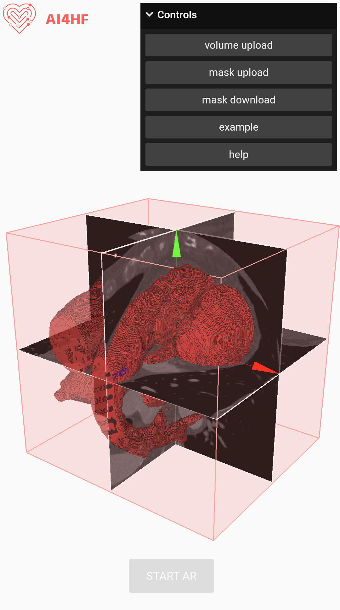
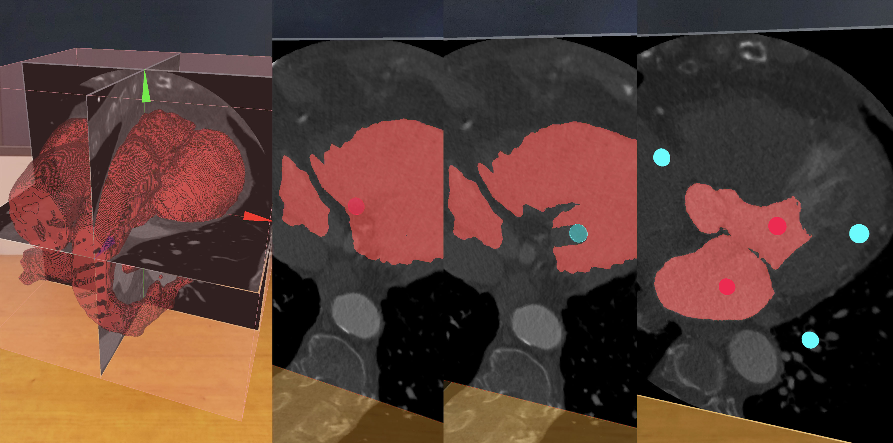
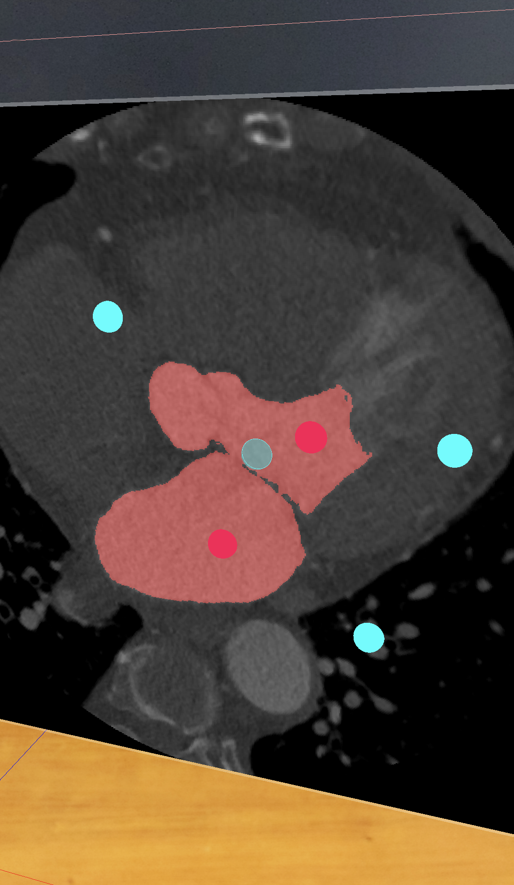

# MPR Viewer

<p align="center">
  
</p>

Browser-based medical volume viewer for loading NIFTI data, exploring orthogonal slice planes, editing masks, prompting 2D segmentation, and placing the volume in AR on supported mobile devices.

This project combines:

- multi-planar reconstruction (MPR) viewing
- manual mask editing
- prompt-based segmentation with MobileSAM
- browser-first interaction with optional WebXR AR support

## Overview

The app is served from the `docs/` folder and runs as a single-page Three.js application. It can be used in two ways:

- Desktop/browser mode for everyday inspection, editing, and segmentation with mouse controls
- WebXR mode on supported phones for AR placement and gesture-based interaction

Main capabilities:

- Load NIFTI volumes and masks
- Inspect three orthogonal slice planes
- Visualize a 3D mask rendering alongside the slice stack
- Paint masks directly on slices
- Use positive/negative prompts for slice-based segmentation
- Switch between browser workflow and XR workflow without maintaining separate apps

## Gallery

### Viewer and volumetric rendering



### Mode overview



### Manual editing workflow


### Prompt-based segmentation



## Features

- `Place`: move, rotate, and scale the volume assembly
- `Inspect`: reposition slice planes and explore the dataset
- `Edit`: paint directly into the segmentation mask
- `Segment`: add positive and negative prompt points and let the worker propose a mask
- WebXR AR placement with hit testing on supported mobile devices
- Example NIFTI data included in the repository for quick testing

## Desktop Controls

These controls are available in the browser workflow:

- `1 / 2 / 3 / 4`: switch `Place / Inspect / Edit / Segment`
- `Right mouse drag`: orbit the camera
- `Mouse wheel`: zoom the camera
- `Ctrl + Z / Ctrl + Y`: undo / redo
- `G`: reset the active mode
- `X`: toggle add/subtract brush mode in `Edit` and `Segment`
- `C`: clear prompt points in `Segment`

Per mode:

- `Place`
  Move the whole volume with left drag, rotate with `Alt + left drag`, scale with `Shift + wheel`
- `Inspect`
  Move a slice with left drag on a plane, rotate the slice stack with `Alt + left drag`, toggle a plane with double click
- `Edit`
  Paint with left drag, resize the brush with `Shift + wheel`
- `Segment`
  Add prompt points with left click, move the slice with `Alt + left drag`, fine-step the slice with `Alt + wheel`, resize the prompt brush with `Shift + wheel`

## XR Workflow

On WebXR-capable mobile devices, the original AR flow is still available:

- place the display using AR hit testing
- use gesture input for manipulation
- work with the same modes inside the XR session

The current desktop workflow is the easiest way to inspect and debug the application, while XR remains useful for in-situ spatial placement and presentation.

## Project Structure

```text
.
|-- docs/
|   |-- index.html            # app shell
|   |-- style.css             # UI styling
|   |-- script.js             # bootstrap entry
|   |-- static/               # README screenshots
|   |-- prm/                  # shaders, worker, models, sample data
|   `-- src/
|       |-- Experience.js     # central app entry
|       |-- core/             # XR, UI, interaction, workers, utilities
|       `-- managers/         # display, screen, model, mask, brush, etc.
|-- PROJECT_CONTEXT.md        # durable architecture summary
`-- readme.md
```

## Tech Stack

- Three.js
- WebXR / `ARButton`
- custom XR gesture handling
- TensorFlow.js
- ONNX Runtime Web
- MobileSAM encoder/decoder models
- PIXPIPE for NIFTI decoding

## Getting Started

### Requirements

- Node.js
- npm

### Install

```bash
npm install
```

### Run locally

```bash
npm run dev
```

Then open:

```text
http://localhost:3000
```

## Example Data

The repository includes sample assets for quick testing:

- `docs/prm/lung.nii.gz`
- `docs/prm/lung_mask.nii.gz`

You can load them from the built-in `Examples` controls in the UI.

## Deploy to GitHub Pages

The app already lives in `docs/`, so the simplest GitHub Pages setup is to publish that folder directly.

Recommended setup:

1. Push the repository to GitHub.
2. Open `Settings -> Pages`.
3. Set `Source` to `Deploy from a branch`.
4. Choose branch `main`.
5. Choose folder `/docs`.
6. Save.

That matches the current repository structure and avoids maintaining a separate build output just for deployment.

## Current Architecture

The app was refactored from a single monolithic script into a manager-based structure centered on `docs/src/Experience.js`.

Key runtime modules:

- `core/DesktopControls.js`: browser-only mouse controls
- `managers/SceneManager.js`: renderer, camera, scene graph
- `managers/UIManager.js`: GUI and help modal wiring
- `managers/XRManager.js`: AR button, XR update loop, hit testing
- `managers/SegmentationWorkerManager.js`: worker lifecycle and segmentation orchestration
- `managers/ScreenManager.js`: slice planes and slice uniforms
- `managers/ModelManager.js`: 3D mask rendering
- `managers/MaskManager.js`: editable mask texture state

For a deeper technical summary, see [PROJECT_CONTEXT.md](PROJECT_CONTEXT.md).

## Notes

- The viewer currently focuses on the `Place`, `Inspect`, `Edit`, and `Segment` workflow
- The segmentation pipeline is slice-based and optimized around the current visible segmentation slice workflow
- Browser mode and XR mode share the same scene/state instead of being separate applications

## License

See [Licence](Licence).
